# Configuration

* `cd ${PATH}/VCM`
* `mkdir build`
* `cd build`
* `cmake-gui ..`
* `configure` (with lots of warnings)
* `generate`
* Double click *VCM-PathTracer.sln*
* Set *optixPathTracer* as start-up project
* Run


# Bidirectional Photon Mapping with OptiX

<!-- 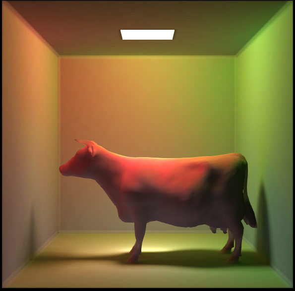 -->

#### What is Bidirectional Photon Mapping?

Bidirectional Photon mapping is an unbiased algorithm that uses techniques from bidirectional path tracing and photon mapping. It is a two-pass algorithm similar to that of photon mapping. The main differences between BDPM and PM & BDPT are:

 - The first pass differs by adding path weights to the photon paths in terms of their probabilities, like so,

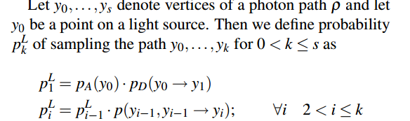

 - The second pass incorporates MIS weights from the number of `t` bounces (i.e., the camera rays) by also using the probabilities stored with photon paths.

The main drawback of this method currently is that progressive methods is not possible but can be added.

In terms of what we learnt during the implementation of this algorithm is that, MIS weights can really be a pain and debugging on OptiX can get really monotonous since Nsight does not work with the current version of it (OptiX 4.0).

OptiX however offers a lot of in-built functionalities like BVH acceleration structures and intersection frameworks. This however can get in the way if you want to learn Path tracing as a whole. This API is **not** suitable for those who are just beginning out to learn about Path tracing.


| BDPM | PM | BDPT | PT |
| ---- | -- | ---- | -- |
| 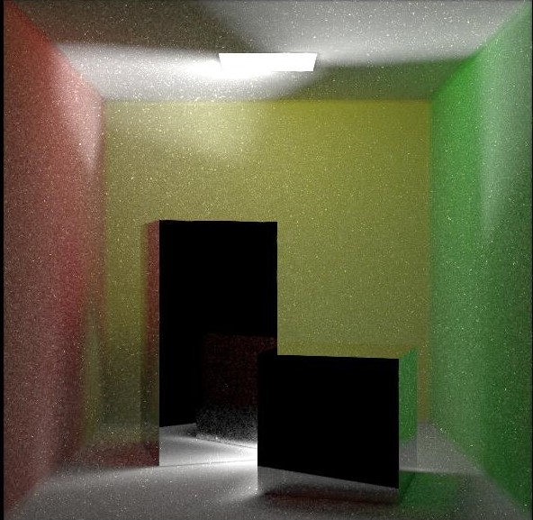 | 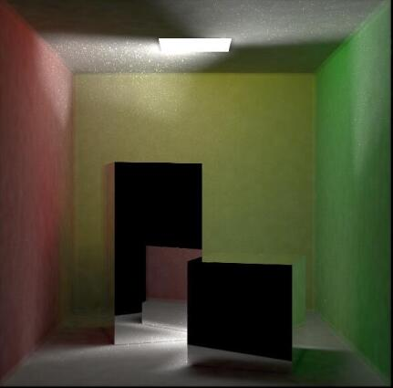 | 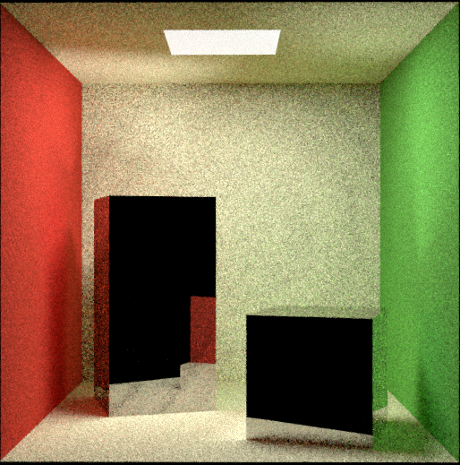 | 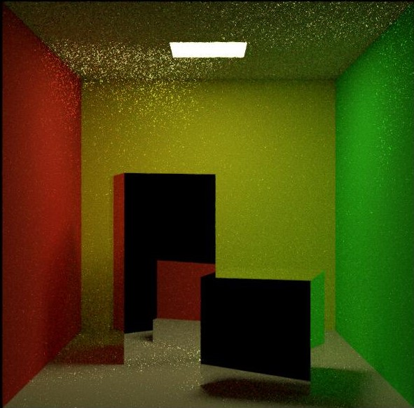 |


#### What is Bidirectional Path Tracing?

The following image from [Veach's Thesis](https://graphics.stanford.edu/courses/cs348b-03/papers/veach-chapter10.pdf) best describes BDPT:

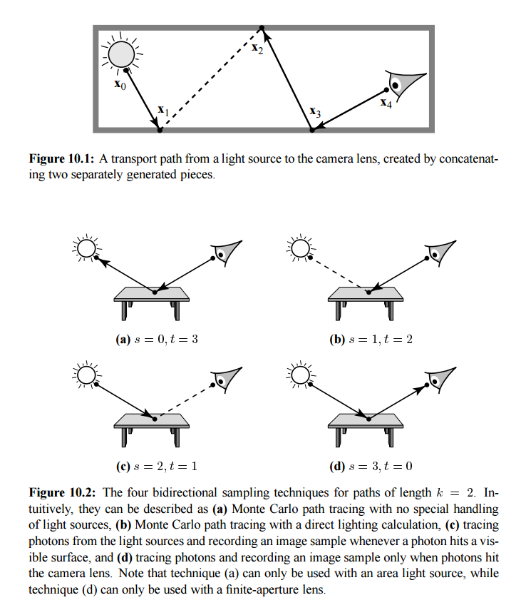

Screenshots
-----------


This test scene has a total of 880,002 tris and 439,909 verts

- Knot: 2,880 tris
- Cow: 5,804 tris
- Dragon: 871,306 tris

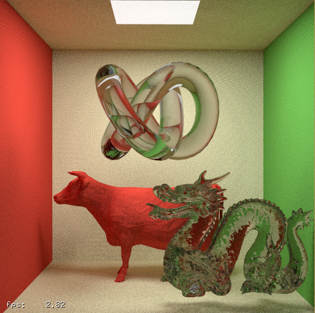

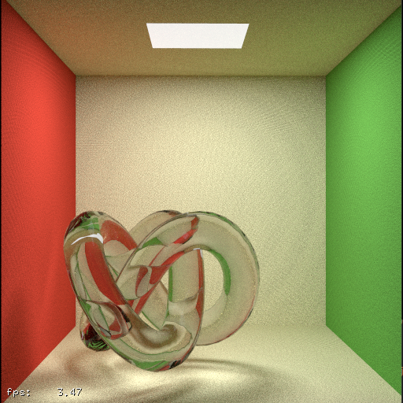

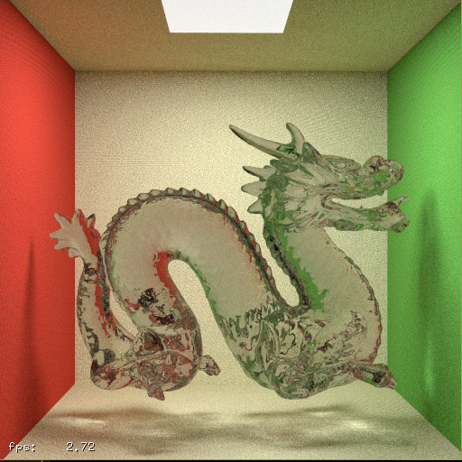

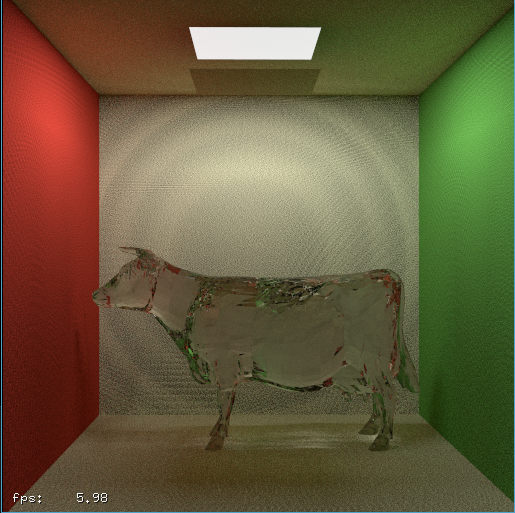

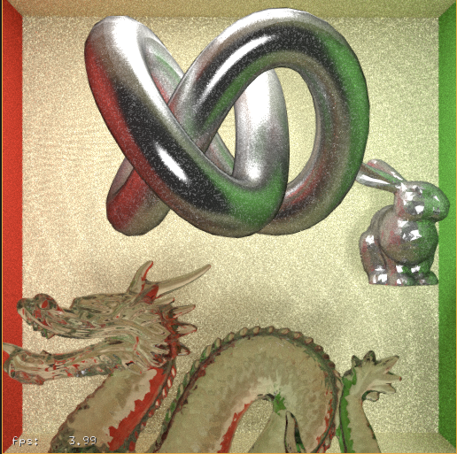

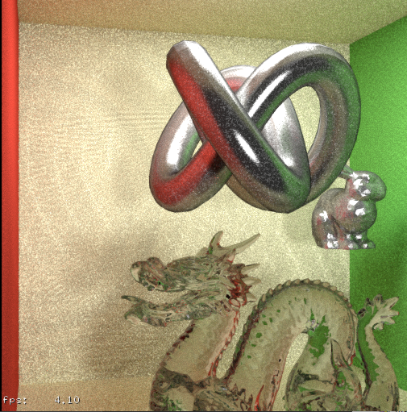

Debug Screenshots
-----------------

The more the pixel is white, the more time it took/spent in that space.

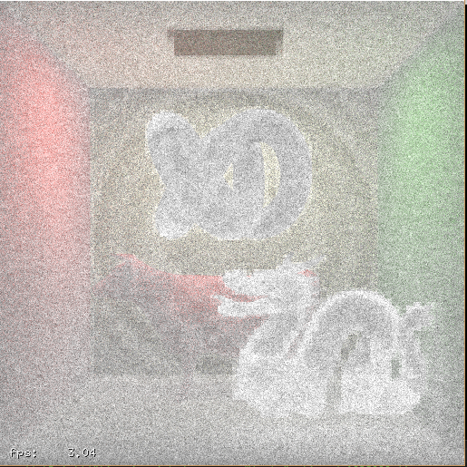

With more iterations, it is clear that the refractive objects have more time spent with them.

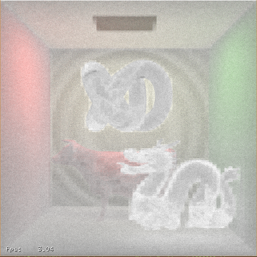


Analysis
--------
All of the analysis has been done on the following test scene:


This test scene has a total of 880,002 tris and 439,909 verts

Analysis Nsight offers:
----------------------------

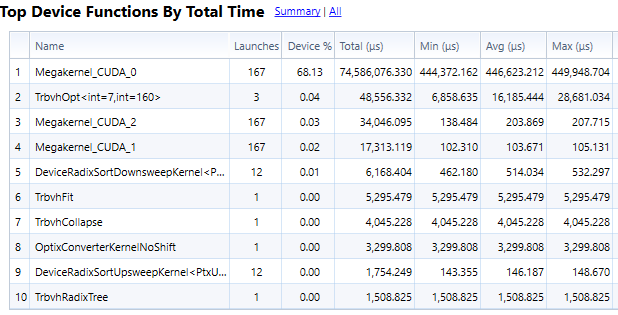

Here in the above image, Megakernel_CUDA_0, Megakernel_CUDA_1 and Megakernel_CUDA_2 offer no meaningful summary with unknown functions in those "Megakernels". The TrBvh time spent is the bvh construction and parsing, again offers no real beneficial timing analysis. Rather we look at high level memory calls and times as shown in the following image.

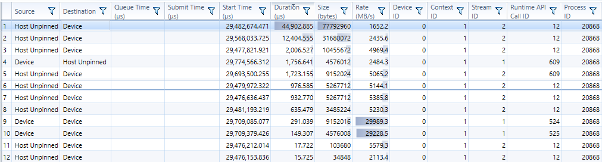

Something to consider is that:

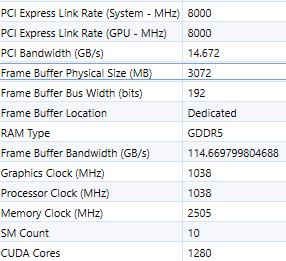

Timing analysis with OptiX is a challenge as Nsight only offers a high level view of the kernel functions and no performance evaluations for each kernel call. To get around this and get a simple timing evaluation, we do:

```c++
clock_t start_time = clock();
// some small amount of code
clock_t stop_time = clock();

int time = (int)(stop_time - start_time);
rtPrintf("time in func foo: %f\n", time / clockRate);
```

>  when executed in device code, returns the value of a per-multiprocessor counter that is incremented every clock cycle. Sampling this counter at the beginning and at the end of a kernel, taking the difference of the two samples, and recording the result per thread provides a measure for each thread of the number of clock cycles taken by the device to completely execute the thread, but not of the number of clock cycles the device actually spent executing thread instructions. The former number is greater that the latter since threads are time sliced.

taken from [JackOLantern's answer on SO](http://stackoverflow.com/questions/19527038/how-to-measure-the-time-of-the-device-functions-when-they-are-called-in-kernel-f)

where `clockRate` is the shader clock frequency.
in my case with a Nvidia 970M card, the shader clock frequency was 1038000Hz.

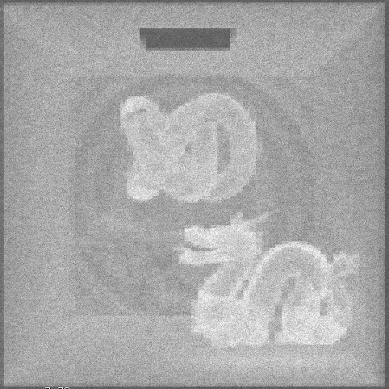

This image above, shows a heatmap of sorts with the value of `time / clockRate * scale` being rendered onto the image. The scale was added so that the image doesn't look too blown out.
With this image, we can clearly tell where most of the time is being spent. The diffuse surfaces: the cow, walls, ceiling and floor have the same general shade implying a lesser time being bottle-necked there and the refractive surfaces: dragon and knot (with ior 1.6) have most close-to-white coloring.

Here is another example:

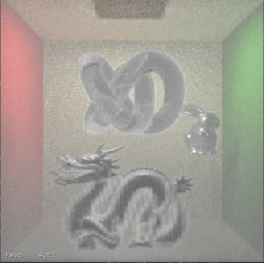

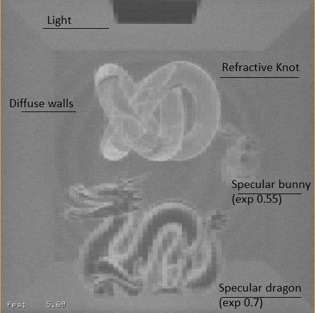

In the above image, it is interesting to note that the edges/outlines in the dragon mesh take longer than other parts of the mesh because of that fact that the material is specular and the calculation is affected more around the edges due to the reflection within the room. The legs also have significant amount of work due to self-reflection. The bunny however is expensive all-around since the triangles are small enough to reflect the diffuse walls around them. The refractive knot (IOR=1.6) is the most expensive to render in this scene.

The following two graphs show a comparison between two methods of `JoinVertices`:
- **Fast connection** means selecting a light at random to join light subpaths from
- **No fast connection** means going through the list of all the lights and doing `JoinVertices` for all the light subpaths

Even with a single light in the scene, the fast connection yields a slightly better performance result. However, the colors converge slower in a scene with more than 3 lights and that significantly trumps the use of fast connection in larger scenes with multiple lights.
The values are in ms for the amount spent in `pinhole_camera` where `JoinVertices` is being called.
The switch between fast connection is done via `#define FAST_CONNECTION`.

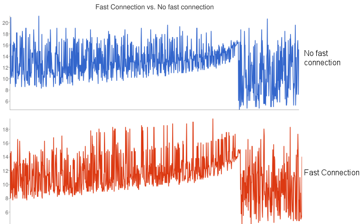

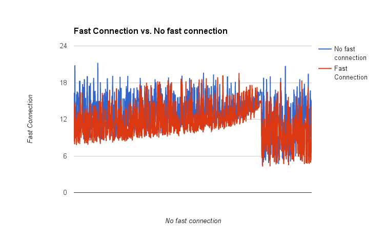

The horizontal axis is the ray index.

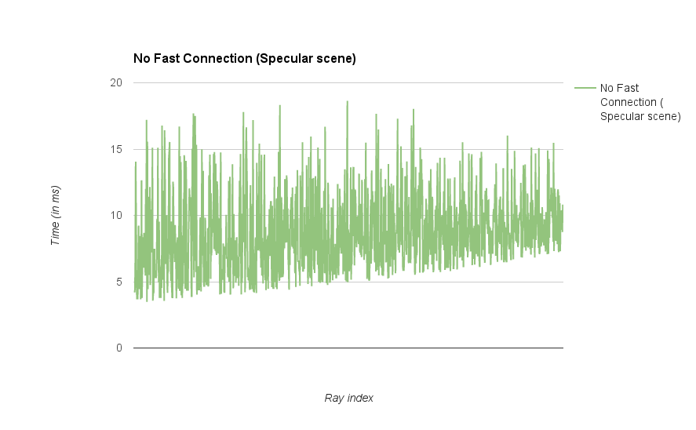

The graph above shows the time for 1024 rays with two specular meshes and one refractive mesh in the scene.  

Another useful analysis is the number of rays being traced in the scene with 2 refractive objects and 3 diffuse objects:

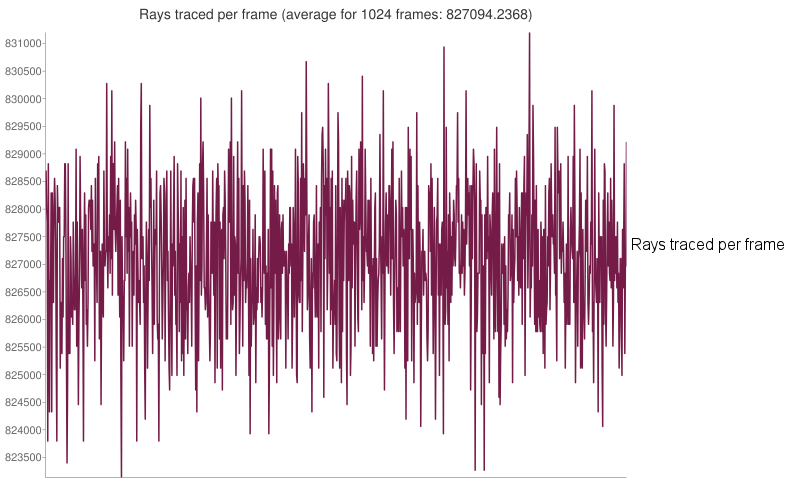

The above graph is just a representation of the number of rays being traced in the scene per frame. This is a valuable piece of information as this could be optimized for a specific kind of scene to be a max. For example, a scene with only (or fewer) specular objects, the rays could be capped at a higher rate than 827,094 rays/frame. (This is the average rays per frame for the current test scene). This could highly benefit large scenes since BDPT is not really suited for SDS paths.
As we found out the average rays/frame for a scene with only a diffuse cow and the cornell box was ~130k, we could start with more rays to get to converge faster but get a similar framerate as the test scene (the average framerate for test scene was 2.2fps). The framerate with diffuse cow and cornell box was ~13fps

###### Average time spent in `pinhole_camera`
| No fast connection | Fast connection |
| --------------- | ------------------ |
| 12.8379151 ms   | 11.5327505ms       |

Another optimization to Optix Mesh loading and bvh construction is the all meshes in a single obj. This increases performance only slightly but better nonetheless. The reason for this could be that a static scene benefits if the `GeometryGroups` are flattened.

| One Obj file | Several (7) Obj files |
| ------------ | --------------------- |
| ~10ms         | ~12ms                |

The following graph shows a timeline of the amount of time spent in `JoinVertices` a crucial part of Bidirectional Path tracing where a light subpath is "joined" to a camera subpath. The occasional bursts in time show a pattern that repeats every other frame. This could mean that for every new set of light and camera subpaths, there is an initial cost to calculate the ray that joins the two.  

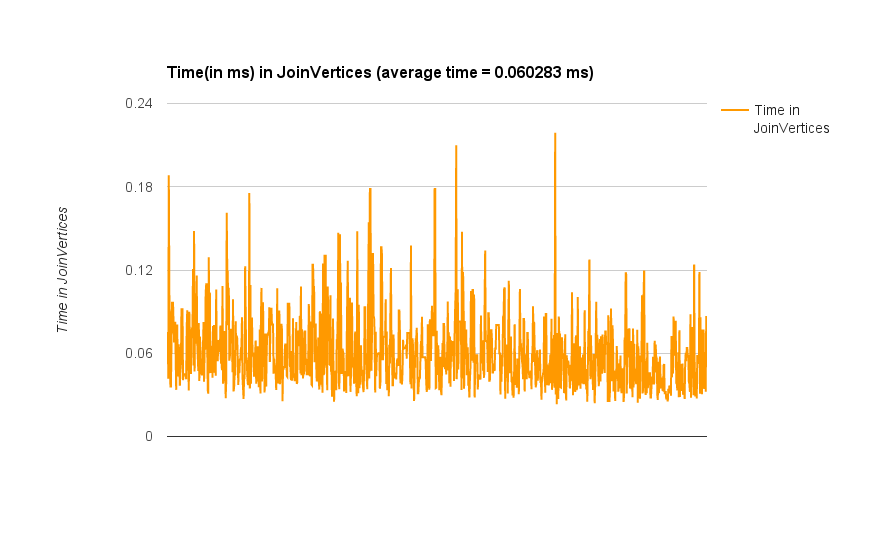

The following graph shows the time spent (in ms) in calculating DirectLighting. The spurt in the graph after a while indicates the refractive subapths from either light or the camera. This is a drawback of BDPT where the SDS paths are extremely expensive to calculate.


###### Memory snapshots and GPU utilization


In this following image, the "Performance & Diagnostics" tool was used from Visual Studio 2013. This screen shot shows the memory utilization during the rendering of the said test scene. There are two refractive (IOR=1.6) objects (dragon and knot) in the scene.  

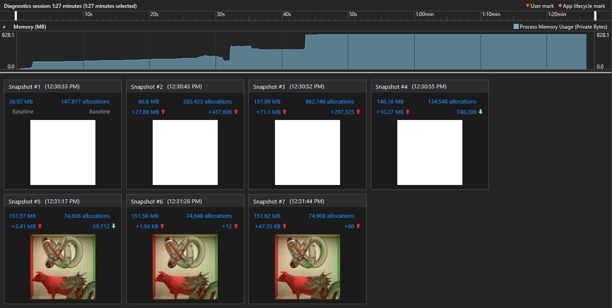

This following image shows GPU utilization. This statistic is however meaningless as there is no further useful information other than the GPU is being 100% utilized.

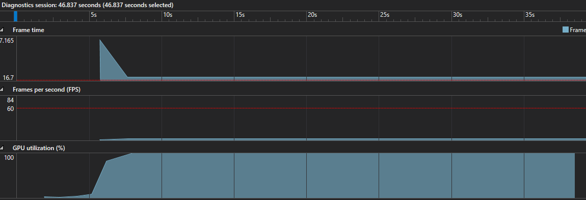

###### Comparison with Path tracing

| BDPT | MCPT |
| ---- | ---- |
| 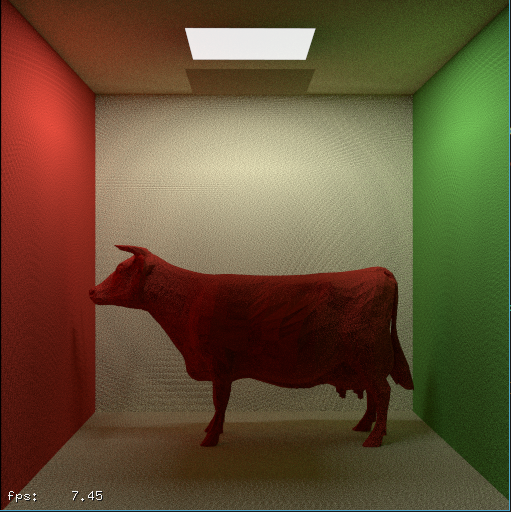 | 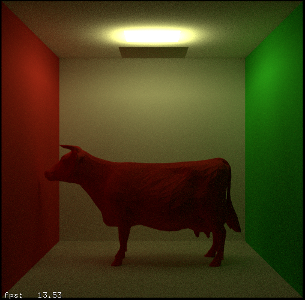 |

# Photon Mapping

#### What is Photon Mapping?

Photon mapping is a two-pass global illumination algorithm developed by Henrik Wann Jensen that approximately solves the rendering equation. Rays from the light source and rays from the camera are traced independently until some termination criterion is met, then they are connected in a second step to produce a radiance value.

Here's a [good introduction](https://web.cs.wpi.edu/~emmanuel/courses/cs563/write_ups/zackw/photon_mapping/PhotonMapping.html).

Screenshots
-----------

#### Results (11 million photons)

<table class="image">
<tr>
	<td>Pre-pass</td>
	<td>Second-pass</td>
</tr>
<tr>
	<td>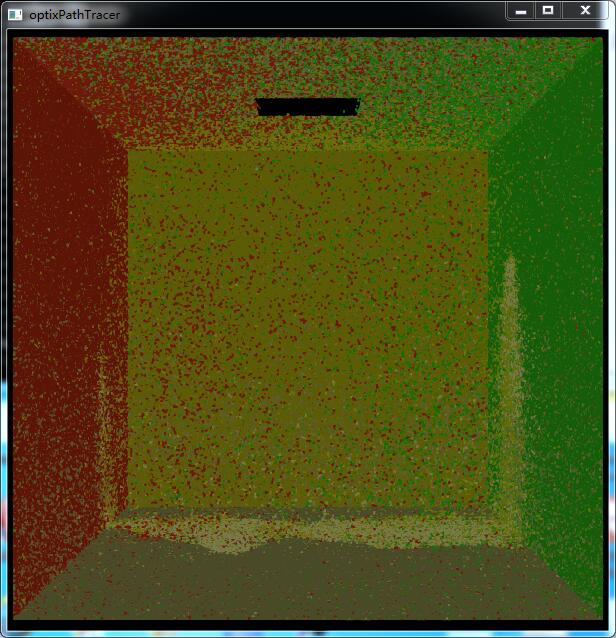</td>
	<td>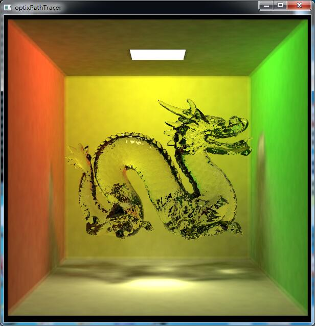</td>
</tr>
<tr>
	<td>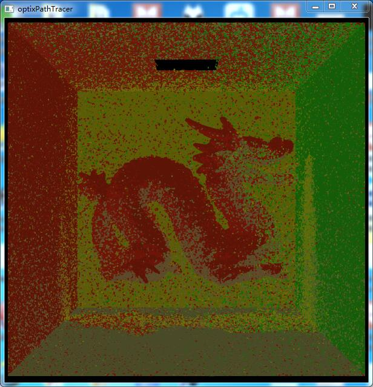</td>
	<td>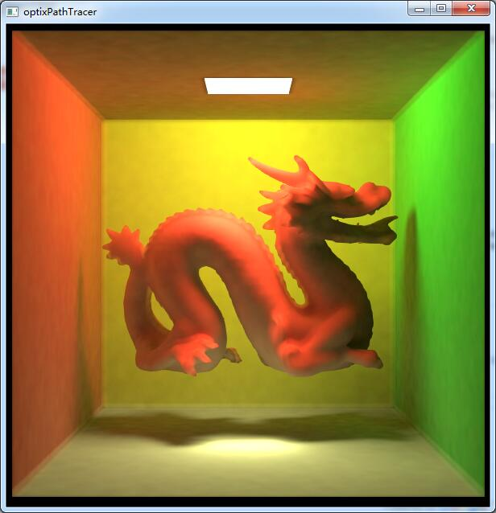</td>
</tr>
<tr>
	<td>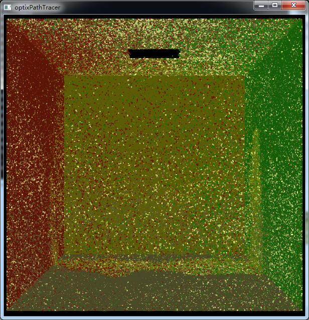</td>
	<td>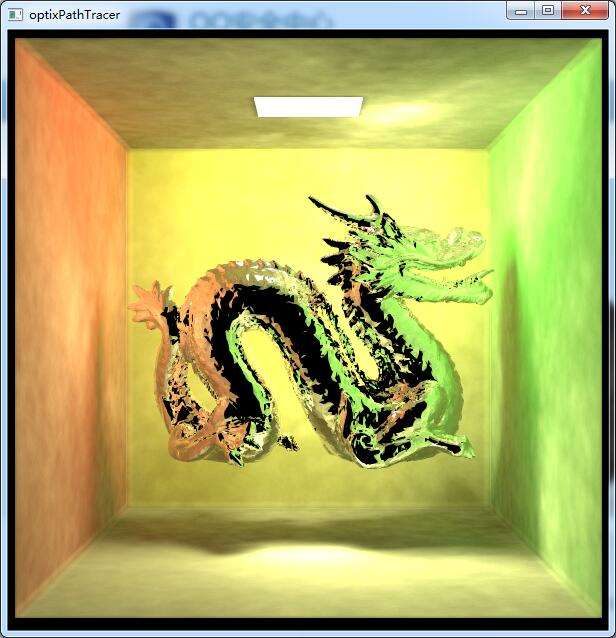</td>
</tr>
</table>

#### Photon Visualization

The shadow looks not correct enough because we shoot photons only from one corner of our parallelogram light.

Photons are experiencing z-flipping because there're too many photons and if the camera isn't close enough, lots of them are overlapped.

<table class="image">
<tr>
	<td>Original image</td>
	<td>Photons</td>
</tr>
<tr>
	<td>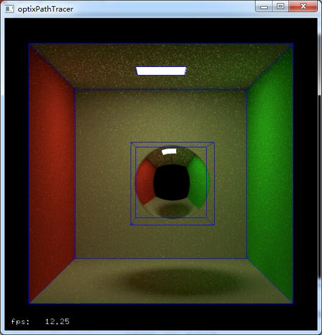</td>
	<td></td>
</tr>
</table>

### Analysis

Time cost in the pre-pass: (Using Russian-Roulette to terminate the rays randomly, you can see the life time of the rays with high variance)

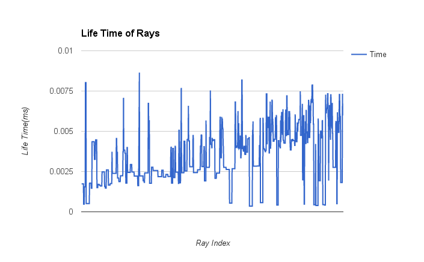

Time cost in the second-pass: (cornell box scene with diffuse walls and a specular shpere in the middle, which means most of rays bounce only once except for the rays hitting specular material)

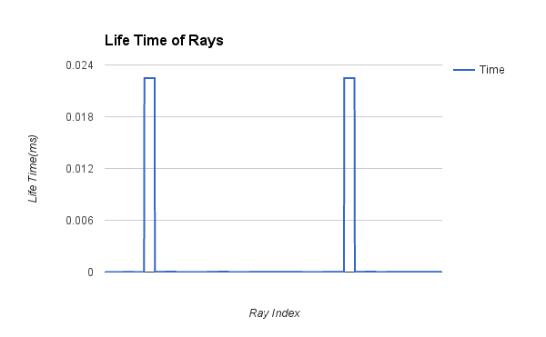

Time cost in the second-pass: (cornell box scene with diffuse walls and a glass cow in the middle, which means rays hitting the cow take more time)

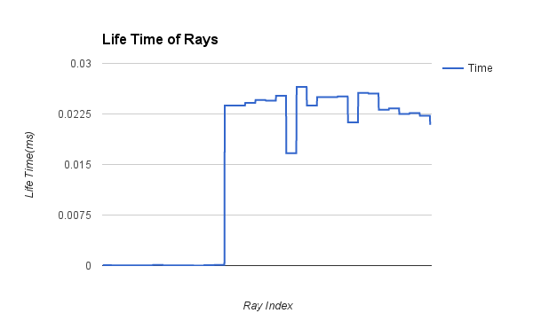


#### References:
* [SmallVCM](https://github.com/SmallVCM/SmallVCM)
* [BDPT, Veach's Thesis, Ch 10](https://graphics.stanford.edu/courses/cs348b-03/papers/veach-chapter10.pdf)
* [Optix performance guidelines](https://docs.nvidia.com/gameworks/index.html#gameworkslibrary/optix/optix_performance_guidelines.htm%3FTocPath%3DGameWorks%2520Library%7COptiX%7COptiX%25204.0%7COptiX%2520Programming%2520Guide%7C_____10)
* [Timing with CUDA events on SO](http://stackoverflow.com/questions/6959213/timing-a-cuda-application-using-events)
* [How to Implement Performance Metrics in CUDA C/C++](https://devblogs.nvidia.com/parallelforall/how-implement-performance-metrics-cuda-cc/)
