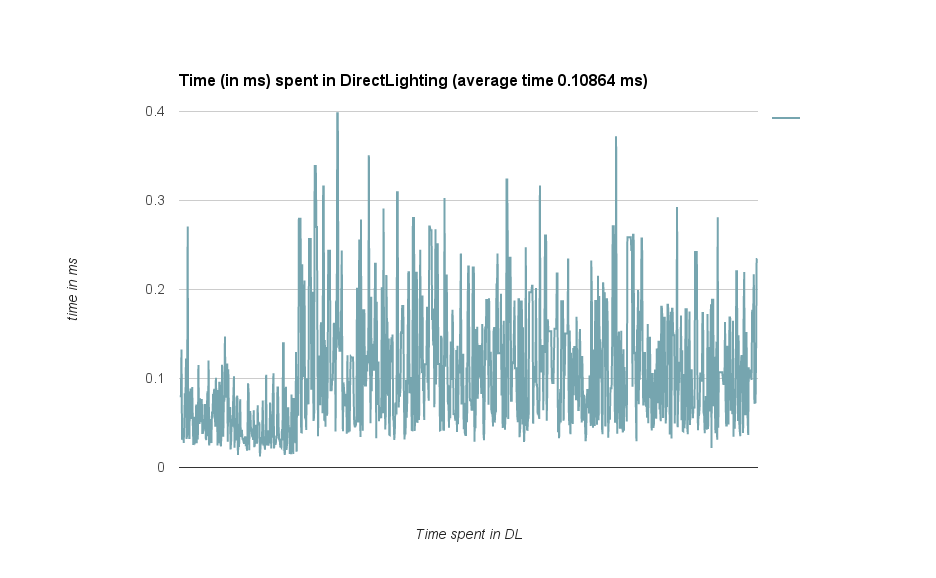

# Bidirectional Path Tracer with OptiX

Screenshots
-----------

This test scene has a total of 880,002 tris and 439,909 verts

- Knot: 2,880 tris
- Cow: 5,804 tris
- Dragon: 871,306 tris


Debug Screenshots
-----------------

The more the pixel is white, the more time it took/spent in that space.


With more iterations, it is clear that the refractive objects have more time spent with them.


Analysis
--------
All of the analysis has been done on the following test scene:


This test scene has a total of 880,002 tris and 439,909 verts

Analysis with Nsight offers:


Here Megakernel_CUDA_0, Megakernel_CUDA_1 and Megakernel_CUDA_2 offer no meaningful summary with unknown functions in those "Megakernels". The TrBvh time spent is the bvh construction and parsing, again offers no real beneficial timing analysis. Rather we look at high level memory calls and times.


Something to consider is that:


Timing analysis with OptiX is a challenge as Nsight only offers a high level view of the kernel functions and no performance evaluations for each kernel call. To get around this and get a simple timing evaluation, we do:

```c++
clock_t start_time = clock();
// some small amount of code
clock_t stop_time = clock();

int time = (int)(stop_time - start_time);
rtPrintf("time in func foo: %f\n", time / clockRate);
```

>  when executed in device code, returns the value of a per-multiprocessor counter that is incremented every clock cycle. Sampling this counter at the beginning and at the end of a kernel, taking the difference of the two samples, and recording the result per thread provides a measure for each thread of the number of clock cycles taken by the device to completely execute the thread, but not of the number of clock cycles the device actually spent executing thread instructions. The former number is greater that the latter since threads are time sliced.

taken from [JackOLantern's answer on SO](http://stackoverflow.com/questions/19527038/how-to-measure-the-time-of-the-device-functions-when-they-are-called-in-kernel-f)

where `clockRate` is the shader clock frequency.
in my case with a Nvidia 970M card, the shader clock frequency was 1038000Hz.


This image above, shows a heatmap of sorts with the value of `time / clockRate * scale` being rendered onto the image. The scale was added so that the image doesn't look too blown out.
With this image, we can clearly tell where most of the time is being spent. The diffuse surfaces: the cow, walls, ceiling and floor have the same general shade implying a lesser time being bottle-necked there and the refractive surfaces: dragon and knot (with ior 1.6) have most close-to-white coloring.


Another useful analysis is the number of rays being traced in the scene with 2 refractive objects and 3 diffuse objects:


###### Average time spent in `pinhole_camera`
| No fast connection | Fast connection |
| --------------- | ------------------ |
| 12.8379151 ms   | 11.5327505ms       |




###### Comparison with Path tracing

| BDPT | MCPT |
| ---- | ---- |
|  |  |
